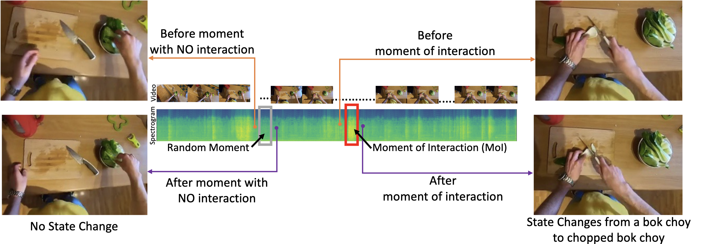

# Self-Supervised Representation Learning from Videos of Audible Interactions

Code release for the paper Self-Supervised Representation Learning from Videos of Audible Interactions.

Authors: Himangi Mittal, Pedro Morgado, Unnat Jain, Abhinav Gupta

[[Arxiv (Paper + Supplementary)]()]

### Introduction
We propose a self-supervised algorithm to learn representations from egocentric video data. Recently, significant efforts have been made to capture humans interacting with their own environments as they go about their daily activities. In result, several large egocentric datasets of interaction-rich multi-modal data have emerged. However, learning representations from videos can be challenging. First, given the uncurated nature of long-form continuous videos, learning effective representations require focusing on moments in time when interactions take place. Second, visual representations of daily activities should be sensitive to changes in the state of the environment. However, current successful multi-modal learning frameworks encourage representation invariance over time. To address these challenges, we leverage audio signals to identify moments of likely interactions which are conducive to better learning. We also propose a novel self-supervised objective that learns from audible state changes caused by interactions. We validate these contributions extensively on two large-scale egocentric datasets, EPIC-Kitchens-100 and the recently released Ego4D, and show improvements on several downstream tasks, including action recognition, long-term action anticipation, and object state change classification.

For more details, please refer to our [paper]() or [project page]().



### Citation
If you find our work useful in your research, please cite:
```
```

## Installation
(a). Clone the repository
```
git clone https://github.com/HimangiM/SSRL_N2022.git
```
(b). Install dependencies by setting up conda
```
conda env create -f environment.yml
```

## Self-Supervised Training

### Training on EPIC-KITCHENS-100

Run the following command. Change the logging.name to create new log directories.

```
sh commands/command_train_epic_kitchens.sh 
```

### Training on Ego4D

```

    1. Full model w/o avid - done
    2. Full model minus moi detection - done
    3. Full model minus state change loss
```

## Pre-trained models
We provide checkpoints for pre-trained models.

### EPIC-KITCHENS-100 

| Method | Top1 Acc (Verb) | Top1 Acc (Noun) | Top5 Acc (Verb) | Top5 Acc (Noun) | Model |
|------- |-----------------|-----------------|-----------------|-----------------|-------|
| RepLAI w/o AVC | 29.92 | 10.46 | 70.58 | 29.00 | [url]() |
| RepLAI w/o AStC | 29.29 | 9.67 | 73.33 | 29.54 | [url]() |
| RepLAI w/o MoI | 28.71 | 8.33 | 73.17 | 27.29 | [url]() |
| RepLAI (scratch) | 25.75 | 8.12 | 71.25 | 27.29 | [url]() |
| RepLAI | 31.71 | 11.25 | 73.54 | 30.54 | [url]() |
